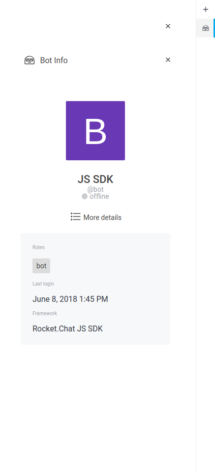
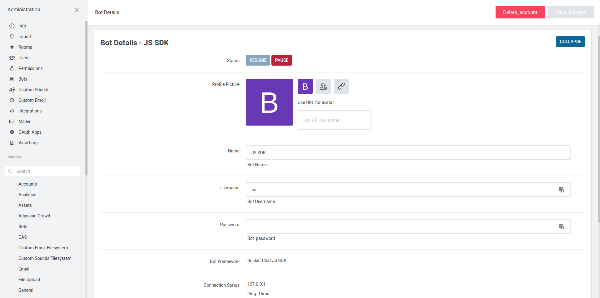

# Bots Management

## External Bots

This section is about external bots. For a definition of external vs internal
bots, see the [Bots FAQ](../bots-faq).

### Listing Bot Users

In order to view a list of all bot users, simply follow the **Administration** > **Bots** menu

### Creating a User on the Server

Only users with the permission `create-bot-account` can create accounts of `type: 'bot'`.

    1. From Administration > Bots menu
    2. Select `+` to make a new bot account
    3. Enter Name, Username and Password
    4. Select the wanted roles if you are not using the `bot` default
    5. Save

Here are the details of each field required to create an account:

    Name: Name of the bot
    Username: Username used by the bot to log in
    Password: Password used by the bot to log in
    Roles: One or more roles that dictate the permissions the account should
      have. Note that a bot account does not need to have the Bot role.
    Join default channels: Whether the newly created account will automatically
      join default channels

After clicking on Save, the account will be created and ready to be used.

Your bot will be configured to login to Rocket.Chat server with the designated bot username and password by using these credentials in the bot's environment `ROCKETCHAT_USER` and `ROCKETCHAT_PASSWORD`

### Visualizing a single Bot User

In the Bots menu, click any listed user to open a sidetab containing additional information about the bot.

{:style="width:40%; height:auto"}

In order to view more details, statistics or edit information about the bot, click on the "More details" button.

{:style="width:100%; height:auto"}

In this page, you can edit everything from the account along with seeing more details about it and act on it, e.g. pause or resume the bot, if its underlying framework supports it.

### Talk to your bot

Your bot will *usually* respond to all messages addressed directly to the bot user (depending on the particular bot framework).
i.e. Messages prepended with `BOT_NAME` or a preconfigured `BOT_ALIAS`.

If the bot is configured to listen on Direct Messages (`RESPOND_TO_DM=true`), the prepend is not necessary (it's automatically added internally) so the bot should respond to all messages in the DM channel.
